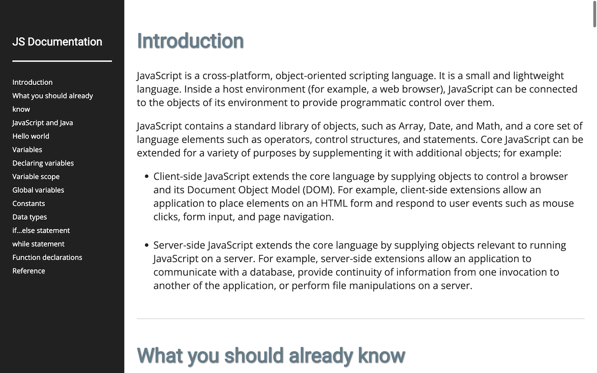

# freeCodeCamp: Build a Technical Documentation Page

This project is a Technical Documentation Page created as part of the Responsive Web Design Projects for freeCodeCamp.

## Table of Contents
- [Overview](#overview)
- [Demo](#demo)
- [Features](#features)
- [Installation](#installation)
- [Usage](#usage)
- [Contributing](#contributing)
- [Acknowledgments](#acknowledgments)
- [User Stories](#user-stories)
- [License](#license)
- [Author](#author)

## Overview

The Technical Documentation Page is designed to showcase technical documentation on various programming concepts. It includes multiple sections, each focusing on a specific topic, and a navigation menu for easy access to different sections.

## Demo

A live demo of this project is available on CodePen: [Technical Documentation Page Demo](https://codepen.io/karlhorning/pen/pxgybR)

## Features

- **Main Content**: The page features a main element with the ID "main-doc," containing several section elements, each classified as "main-section."
- **Navigation**: A navigation menu with the ID "navbar" is provided on the left side of the screen. It includes links (a elements) corresponding to each main section, allowing users to navigate directly to a specific topic.
- **Responsive Design**: The page is designed to be responsive, ensuring a seamless viewing experience on different devices. On regular-sized devices, the navigation menu is displayed on the left side and remains visible at all times.

## Installation

To run this project locally, follow these steps:

1. Clone the repository: `git clone https://github.com/Karl-Horning/fcc-build-a-technical-documentation-page`
2. Open the project folder: `cd fcc-build-a-technical-documentation-page`
3. Open the HTML file in your preferred browser.

## Usage

Feel free to explore the Technical Documentation Page to learn more about different programming concepts. Click on the navbar links to navigate to specific sections of interest.

## Contributing

Contributions are welcome! If you'd like to contribute to this project, please follow these steps:

1. Fork the repository.
2. Create a new branch: `git checkout -b feature/new-feature`
3. Commit your changes: `git commit -am 'Add new feature'`
4. Push to the branch: `git push origin feature/new-feature`
5. Open a pull request.

## Acknowledgments

- [CSS-only (dynamic) line numbers](https://codepen.io/elomatreb/pen/hbgxp): A reference used for implementing dynamic line numbers in the code sections.

## User Stories

This project fulfils the following user stories:

- Display a main element with the ID "main-doc" containing technical documentation.
- Include several section elements with the class "main-section," each with a header describing the topic.
- Provide navigation with a navbar containing links corresponding to each main section.
- Implement responsiveness, ensuring an optimal viewing experience on various devices.
- Clicking on a navbar link navigates to the corresponding section in the main documentation.

## License

This project is licensed under the MIT License - see the [LICENSE](LICENSE) file for details.

## Author

Karl Horning: [GitHub](https://github.com/Karl-Horning/) | [LinkedIn](https://www.linkedin.com/in/karl-horning/) | [CodePen](https://codepen.io/karlhorning)